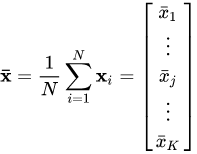
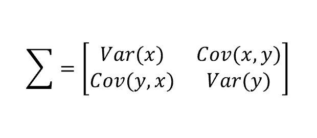
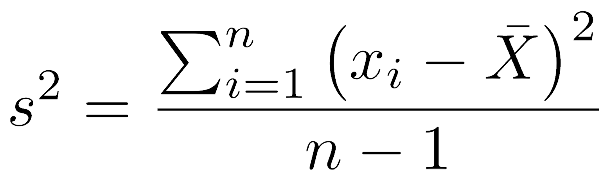
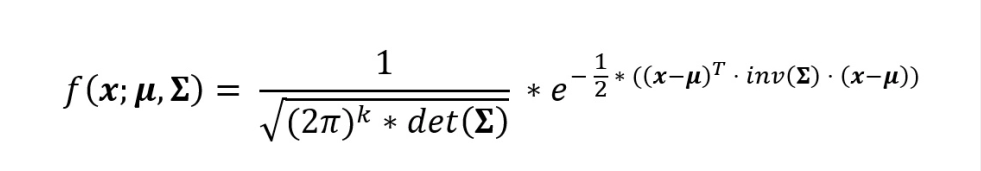
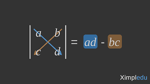
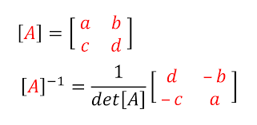
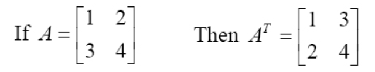

# MultivariateGaussianClassifer

# Overview 
   - I illustrated, and created Gaussian Distribution in one domension, And I explained how it worked,
      And more details in this link (https://github.com/Bassel-A-Elazab/GaussianClassiferFromScratchOneDimension)
   - I complete a gaussian but using multi-vairate/multi-dimension features, 
      And looks at different between it and univariate gaussian.
   - I used a gaussian in two dimensions to look how it works, And looks at different calculations from the one-dimension.
   - We can extend it for using more two dimenions, we created the basics and concepts.
   - Finally gaussian in two dimensions is called (bivariate-normal distribution).
   
   
# What is the multi-variate gaussian?
        
      - Is a vector in multiple normally distributed variables.
      - is a generalization of the one-dimensional,
           (univariate) normal distribution to higher dimensions.
  
# How Multivariate Gaussian Classifer Works ?
    
   The concepts as discussed in one-dimensions (above link) with many different in equations.
   gaussian paramters are( mean, variance, and covariance matrix)
   
      - Step One:
         mean: 
         Calculates the mean for each variables,
         Then we have the mean vector consists of the means of each variable.
         mean = mean of [x1, x2, ..... , xn]
 

      - Step Two: 
         Covariance Matrix: It's the hardest, and important part in algorithm.
            - Is a square matrix giving the covariance between,
                  each pair of elements of a given random vector.
            - In the matrix diagonal there are variances, i.e., 
               the covariance of each element with itself. 
            - Is a measure of how much two random variables vary together.
            - Is symmetric.
            

         How gets value of the above matrix?
            we divide it individually:
               First:
                  - Variance: is a measure of the variability or spread in a set of data.
                  - we calculate variance for variable one (x) and variable two (y),
                     by using next equation.
               Note:
                  - X and Y are represents two features of sample data.
              

   
               Second:
               Covariance:
                  - Calculates Covariance between two variables (X,Y) by using next equation.
               

     
   Where x-dash and y-dash are denoting the means of X and Y, respectively. 
   

      Step Three:
         Probability Density Function (PDF):
            - Is the same As I explained in one-dimension (Link above).
            - Calculates it by using next equation,It seems complex but we divided it into small part, 
               And finally gets the value.
               
         
 
      Let's expain each paramter of the previous equation.

            K: Is the dimenion of the space (length of variables).
            det: The determinant is a scalar value,
                  that can be computed from the elements of a square matrix,
                  And encodes certain properties of the linear transformation described by the matrix. 
            Simply to get determinant of matrix using the next equation,
            But this for two variable of (2*2) dimensions, for large matrix,
                  I provided useful references for this.
            
               
 
            inv: The inverse of the matrix, we calculate inverse of covariance matrix.
                  The next figure shows how to calculate the inverse matrix of (2*2) dimension.
           
 
 
            (x-mu)^T: transpose matrix illustrate it next figure.
            
  
  
            Finallay after multiplication all of these parameteres,
                  by applying the above operations we get one value,
               Then calcaulates the exponential function of value multiplication by reamining part, 
               Which it's a normalizing constant.
               

      Step Four:
         Predict:
            classify new point to the class labels with the highest probability density function (pdf).
           
            
  
